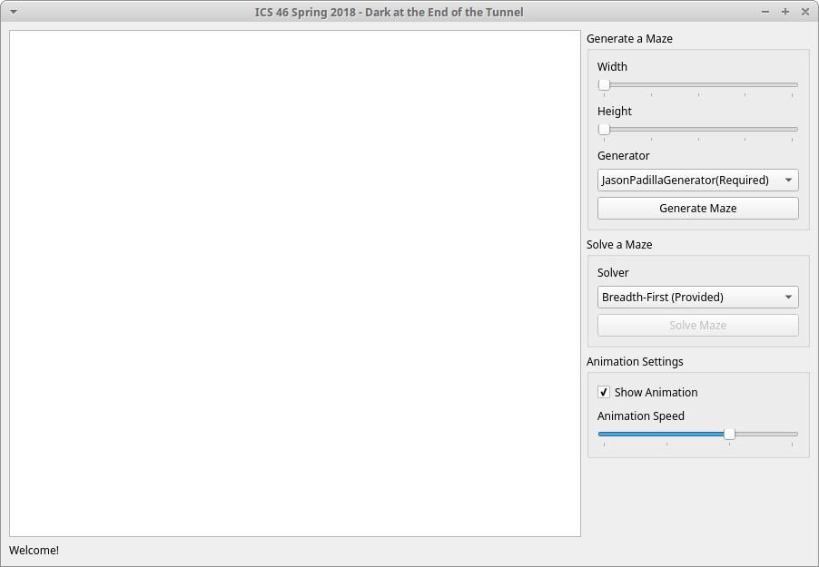
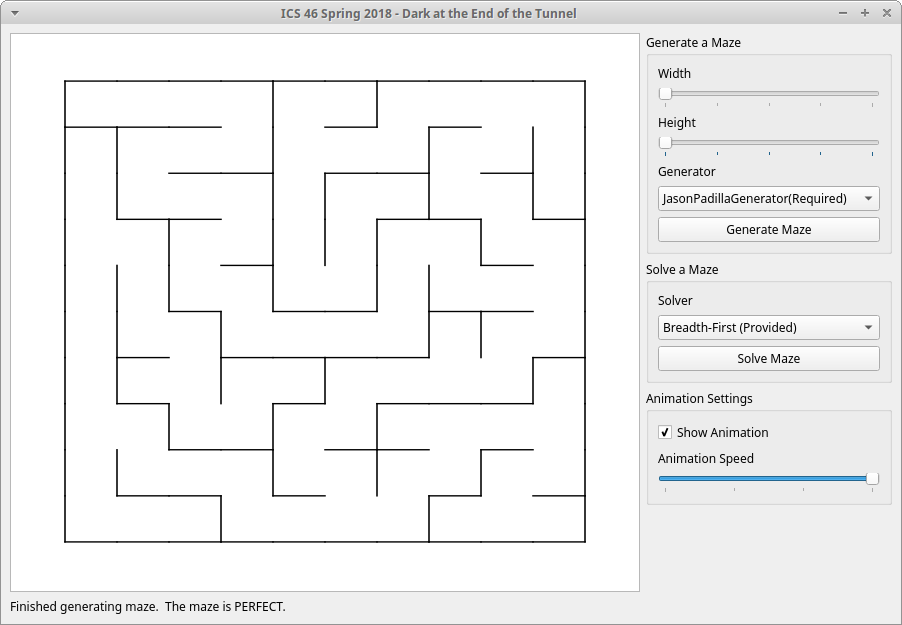
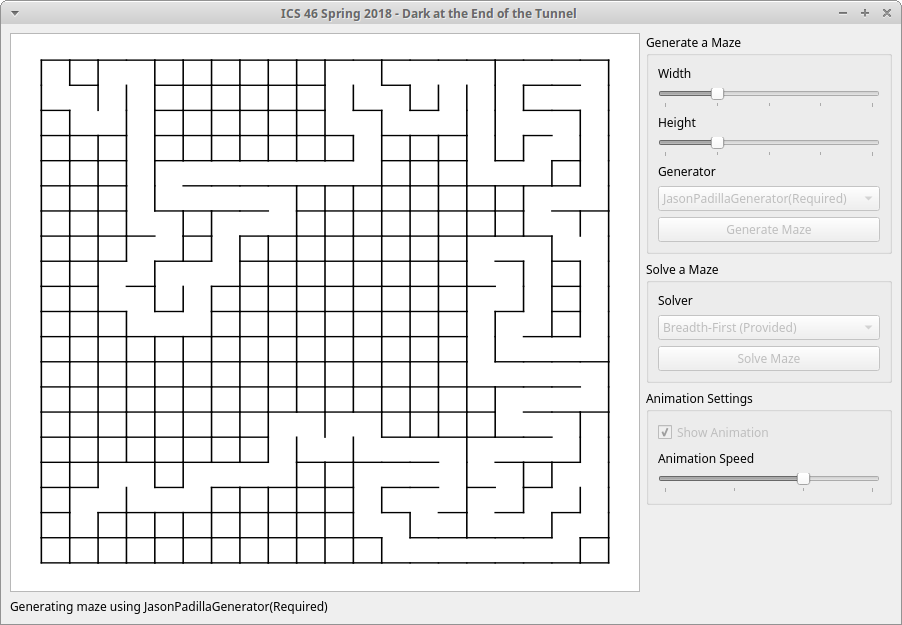
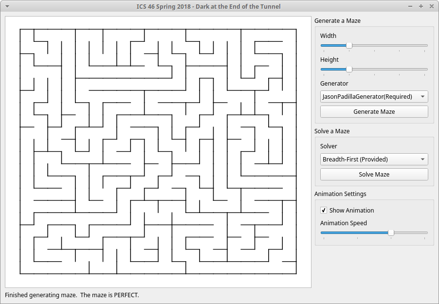
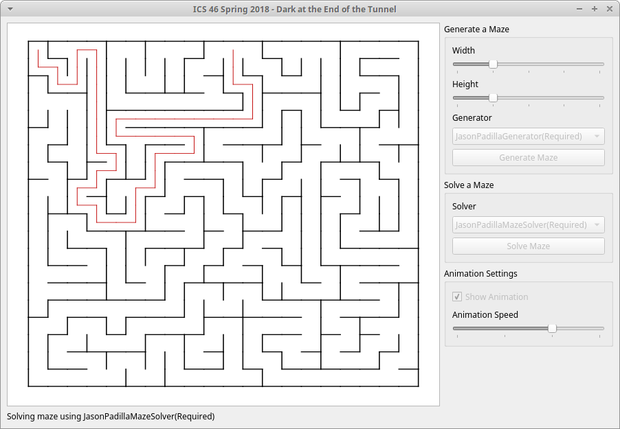
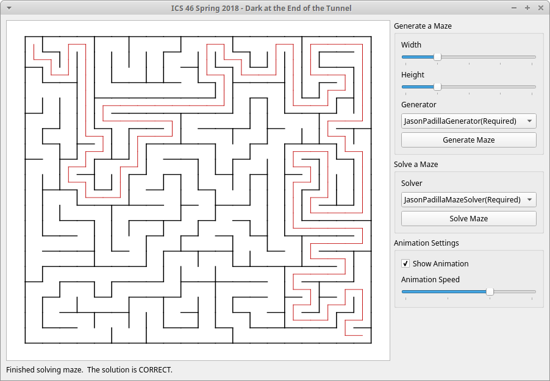

# Maze Generator & Solver
This is a project that I created in one of my Data Stucture classes at UCI. The goal of this project was to build a program that can generate new random mazes and 
also create a program that can solve generated mazes. The program starts by creating a grid of NxM size, then at the top left corner of the grid, at position (0,0), 
it begins to recursively remove random "walls". Once it has removed a wall from a cell it will move onto the next cell in the same direction that the wall was removed
in and once again remove another random wall. The program uses a depth-first algorithm to continue removing walls, if it reaches a cell that has 3 walls removed 
or a out of bounds wall it will go back to a previous cell and continue removing walls until every cell has been reached. The second part of the project takes a generated maze 
and begins to solve it by finding a path from the top left corner of the maze to the bottom right corner ([0,0] to [N,M]). The program solves the maze in the same manner it creates 
them by using a depth-frist algorithm. The program moves from cell to cell until it reaches a dead end in which it will then go back to a previous location and begin
a new path until it reaches its final destination (N,M).

# What I learned
  * Practiced Recursion
  * Used of Depth-First Aglorithm

# Screenshots
Starting Canvas             |  Generated Maze
:-------------------------:|:-------------------------:
  |  
Generating Maze             |  Generated Maze
  |  
Solving Maze             |  Solved Maze
  |  
